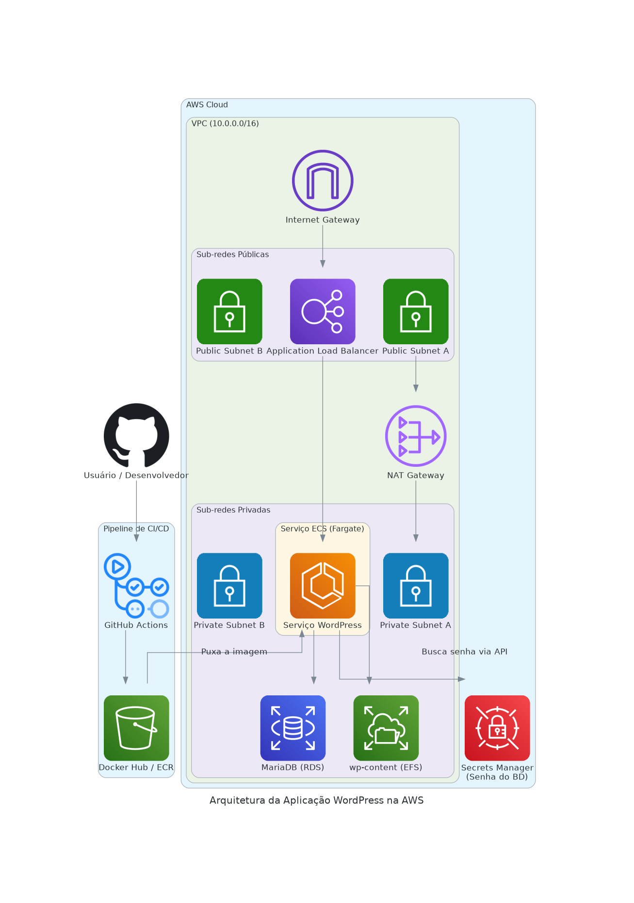

# Desafio Técnico – Solução DevOps para Aplicação PHP (WordPress)

Este repositório contém a solução completa para o Desafio Técnico de Analista DevOps. O objetivo foi modernizar o ciclo de vida de uma aplicação PHP legada, usei o WordPress como um estudo de caso realista. A solução abrange desde a containerização segura e otimizada até o provisionamento de uma infraestrutura resiliente na AWS com Terraform, finalizando com uma estratégia de implantação contínua e observabilidade.

1. Visão Geral da Solução

    - O projeto cria uma fundação sólida para a aplicação, focando em automação, segurança e escalabilidade. As seguintes tecnologias e práticas foram utilizadas

        - **Containerização:** Docker, para empacotar a aplicação WordPress e suas dependências de forma isolada e portátil.

        - **Integração Contínua (CI):** GitHub Actions, para automatizar o build, análise de vulnerabilidades e publicação da imagem Docker.

        - **Infraestrutura como Código (IaC):** Terraform, para provisionar e gerenciar toda a infraestrutura na AWS de forma declarativa e replicável.

        - **Nuvem (Cloud):** AWS, utilizando uma arquitetura serverless e gerenciada com Fargate, RDS, EFS, ALB e Secrets Manager para minimizar a carga operacional.

2. Arquitetura Visual da Solução

    O diagrama abaixo mostra a topologia completa da infraestrutura provisionada na AWS e o fluxo de CI/CD, evidenciando a conexão entre os serviços.

    

3. Containerização e análise de arquitetura do Dockerfile

    ***Arquivo: `Dockerfile`***

    > A containerização foi o primeiro passo, com um Dockerfile projetado com foco em segurança e otimização. As decisões tomadas aqui foram tomadas focando na performance e segurança de todo o ciclo de vida da aplicação.

    1. Decisões Técnicas Implementadas

        - Segurança (Usuário Não-Root)
            Para mitigar o impacto de possíveis vulnerabilidades, o contêiner executa o processo do Apache com o usuário de baixo privilégio www-data.

        - Porta Não Privilegiada (8080)
            Como o contêiner roda com um usuário não-root, ele não tem permissão para usar portas abaixo de 1024. O Apache foi reconfigurado para escutar na porta 8080, seguindo a prática do "menor privilegio".

    2. Análise de decisões de arquitetura do Dockerfile

        - Justificativa da Imagem Base
            > php:8.2-apache vs. outras alternativas. A escolha da imagem `php:8.2-apache` foi uma decisão intencional, baseada em manter o equilíbrio entre controle, simplicidade e segurança.

        1. Comparação de alternativas

            `wordpress:latest`
                A imagem oficial do WordPress é uma "caixa-preta" que, apesar de ser simples, oferece menos controle sobre a configuração do Apache, as extensões PHP e otimizações de segurança. Decidi construir a imagem a partir da `php:apache` pois conseguiria demonstrar entendimento mais profundo da stack, de modo que instalei apenas as extensões PHP necessárias, tendo assim controle total sobre a configuração do servidor web, isso foi essencial para implementar ajustes de segurança como o da porta não privilegiada citada anteriormente.

            `php:8.2-fpm + Nginx`
                Essa é uma arquitetura de alta performance, provavelmente seria minha escolha para um ambiente de produção real, pois ela trás ganhos significativos em questão de isolamento de funcionalidades (proxy reverso + aplicação) e robustez da arquitetura, porém exige a orquestração de dois contêineres. Para o escopo deste desafio, focado em estabelecer a fundação do CI/CD e da IaC, a imagem php:apache me pareceu uma solução mais simples e integrada em um único contêiner, reduzindo a complexidade inicial.

            - Conclusão
                `php:8.2-apache`
                    Representa o melhor ponto de equilíbrio para este projeto, oferecendo o controle necessário para aplicar as melhores práticas sem adicionar complexidade desnecessária na proposta e levando em conta o estágio de modernização.

    3. Análise sobre multi-stage builds (cenário atual e evolução futura)

        > A ausência de multi-stage build no Dockerfile também foi uma decisão intencional.

        - Partindo do cenário atual

            Um multi-stage build faria sentido ao separar o ambiente de build do ambiente de runtime, descartando ferramentas de compilação ou dependências de desenvolvimento. No nosso projeto, o código PHP é interpretado, ou seja, não há compilação e as dependências (extensões PHP) são necessárias para o runtime. Ou seja, não há uma etapa de 'build' separada onde possamos copiar artefatos, e um multi-stage build não traria benefícios significativos.

        - Evolução futura (onde o multi stage se tornaria essencial?)

            Se fossemos dar o próximo passo em relação à modernização, onde faríamos o gerenciamento do core do WordPress e seus plugins via Composer. Nesse cenário, o multi-stage build se tornaria indispensável, pois o primeiro estágio usaria a imagem do composer para baixar todas as dependências, e o segundo estágio copiaria apenas o resultado final (vendor/ e os arquivos da aplicação) para a imagem `php:apache`, resultando em uma imagem final muito menor, mais segura e alinhada com as melhores práticas de desenvolvimento PHP moderno.

4. Integração Contínua (CI) com GitHub Actions

    ***Arquivo: `.github/workflows/main.yml`***

    O pipeline de CI automatiza a construção, validação e publicação da imagem Docker, garantindo que cada alteração no código principal gere um artefato seguro e rastreável.

    O fluxo consiste em:

    - Gatilho: Acionado a cada push na branch main.

    - Build: Constrói a imagem Docker a partir do Dockerfile.

    - Scan de Segurança: Utiliza Trivy para escanear a imagem em busca de vulnerabilidades conhecidas, atuando como um portão de qualidade.

    - Push: Envia a imagem validada para um container registry (Docker Hub).

5. Infraestrutura como Código e Implantação Contínua (IAC & CD)

    ***Arquivos: `terraform/*.tf`***

    1. Infraestrutura como Código (IaC)

        Toda a infraestrutura na AWS é gerenciada de forma declarativa com o Terraform. A arquitetura foi projetada para alta disponibilidade, utilizando duas Zonas de Disponibilidade (AZs) para distribuir recursos como sub redes, o Aplication Load Balancer (ALB) e as tarefas no ECS, garantindo que a falha de um único data center não derrube a aplicação.

        - Justificativa da arquitetura (ECS Fargate)
            > A escolha pelo ECS Fargate em vez de EKS (Kubernetes) foi focada na simplicidade operacional. Fargate, sendo serverless, elimina a necessidade de gerenciar servidores, ou seja contribui diretamente para o objetivo de agilidade e redução da carga operacional.

        - Componentes
            A arquitetura inclui

            - Uma VPC customizada
            - RDS para o banco de dados
            - EFS para persistência de arquivos
            - Secrets Manager para gerenciamento de senhas, tokens etc
            - Um ALB (Aplication Load Balancer) como ponto de entrada.

    2. Extensão para Implantação Contínua (CD)

        O pipeline de CI é a base para a Implantação Contínua. O CD automatiza o deploy da nova imagem no ECS, eliminando o risco de erro humano e acelerando a entrega de valor.

        - Fluxo do pipeline de CD

            - Gatilho e Autenticação
            > Após o sucesso do CI, um novo job de CD será iniciado. Ele se autenticaria na AWS de forma segura usando OpenID Connect (OIDC), que concede permissões temporárias ao pipeline sem a necessidade de chaves de acesso de longa duração.

            - Atualização da definição de tarefa
            > O pipeline baixa a definição da tarefa ECS existente, atualiza o campo "image" com a nova tag da imagem recém-publicada e registra uma nova versão da definição de tarefa no ECS usando aws ecs register-task-definition.

            - Atualização do serviço ECS
            > O passo final é instruir o serviço ECS a usar essa nova versão, forçando uma nova implantação com o comando `aws ecs update-service --force-new-deployment`.

            - Implantação com zero downtime
            > O ECS, em conjunto com o ALB, gerencia a implantação no formato ***rolling update***, então uma nova tarefa é iniciada, aguarda-se que ela se torne saudável, o tráfego é direcionado para ela, e só então a tarefa antiga é desligada.

6. Estratégia de observabilidade

    Para produção, a stack de ferramentas escolhida seria a PLG Stack (Prometheus, Loki e Grafana), utilizando os serviços gerenciados da AWS para garantir escalabilidade e baixa manutenção.

    - As métricas essenciais para um dashboard de saúde seriam

        - Tráfego (via ALB): Latência, Taxa de Erros e Throughput.

        - Saúde dos recursos (via ECS): Utilização de CPU e Memória.

        - Saúde do Banco de Dados (via RDS): Utilização de CPU e Conexões Abertas.

7. Como Executar a Solução

    - Pré-requisitos
        Docker, Terraform, AWS CLI

        - Passos
            - Clone o repositório.
            - Navegue para a pasta terraform e execute terraform init.
            - Execute terraform apply e confirme com yes.
            - Acesse o site através da URL_do_Site_WordPress exibida no output.

8. Como Destruir a Infraestrutura

    Para remover todos os recursos criados na AWS, navegue até a pasta terraform e execute terraform destroy.
